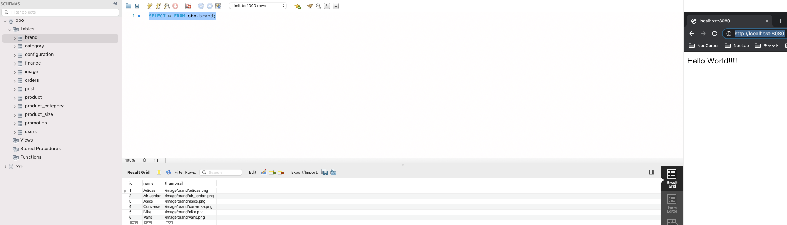

# spring-boot-docker-mysql-helloworld 🐳

## deploy local

1. `docker compose up -d --build`
2. access browser `localhost:8080`

## note

NOT like PHP, Java need rebuild after edit: `docker compose up -d --build`
